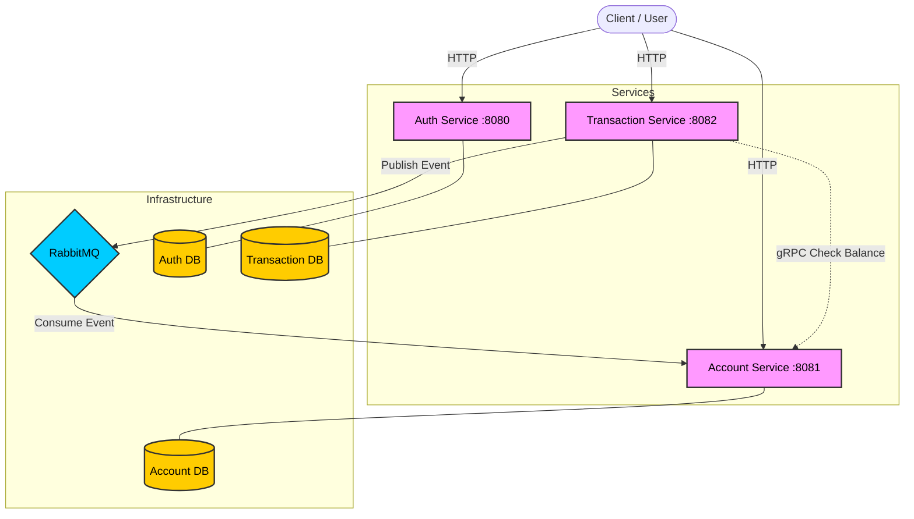

# AIM (Banking Microservices System) 🏦

A robust, distributed banking system built with **Go (Golang)**, implementing **Microservices Architecture**, **gRPC**, **RabbitMQ**, and **PostgreSQL**.

## 🚀 Key Features

* **Microservices Architecture:** Segregated services for Auth, Accounts, and Transactions.
* **Event-Driven (Saga Pattern):** Asynchronous balance updates using **RabbitMQ** to ensure data consistency.
* **gRPC Communication:** High-performance inter-service communication for validations.
* **JWT Authentication:** Secure user authentication and authorization middleware.
* **Dockerized:** Fully containerized environment with **Docker Compose**.
* **Database Per Service:** Independent PostgreSQL instances for each microservice to ensure loose coupling.

## 🛠️ Tech Stack

* **Language:** Go (Golang)
* **Web Framework:** Fiber (v2)
* **Database:** PostgreSQL (GORM ORM)
* **Message Broker:** RabbitMQ
* **Communication:** gRPC (Protobuf), REST API
* **Containerization:** Docker & Docker Compose

## 🏗️ Architecture

This system follows a distributed architecture where the Transaction Service acts as a producer and the Account Service as a consumer to maintain eventual consistency.



## 📦 How to Run

1.  **Clone the repository:**
    ```bash
    git clone https://github.com/dotenv213/aim.git
    cd aim
    ```

2.  **Start the services (Docker):**
    ```bash
    docker compose up --build
    ```
    *Wait for RabbitMQ and Databases to initialize.*

3.  **Test the Endpoints:**
    The system exposes three main ports:
    * **Auth Service:** `localhost:8080`
    * **Account Service:** `localhost:8081`
    * **Transaction Service:** `localhost:8082`

## 🔗 API Endpoints

### 1. Auth Service (:8080)
* `POST /api/v1/auth/register` - Register a new user
* `POST /api/v1/auth/login` - Login and get JWT

### 2. Account Service (:8081)
* `POST /api/v1/accounts` - Create a new bank account
* `GET /api/v1/accounts` - Get user balance

### 3. Transaction Service (:8082)
* `POST /api/v1/contacts` - Create a contact
* `POST /api/v1/transactions` - Create a transaction (Triggers RabbitMQ event)

## 🧪 Simulation
1.  Create a user and login.
2.  Create a bank account (Initial balance: 1,000,000).
3.  Create a transaction (Withdraw 200,000).
4.  Check account balance immediately. It will be updated to 800,000 via the background worker.
